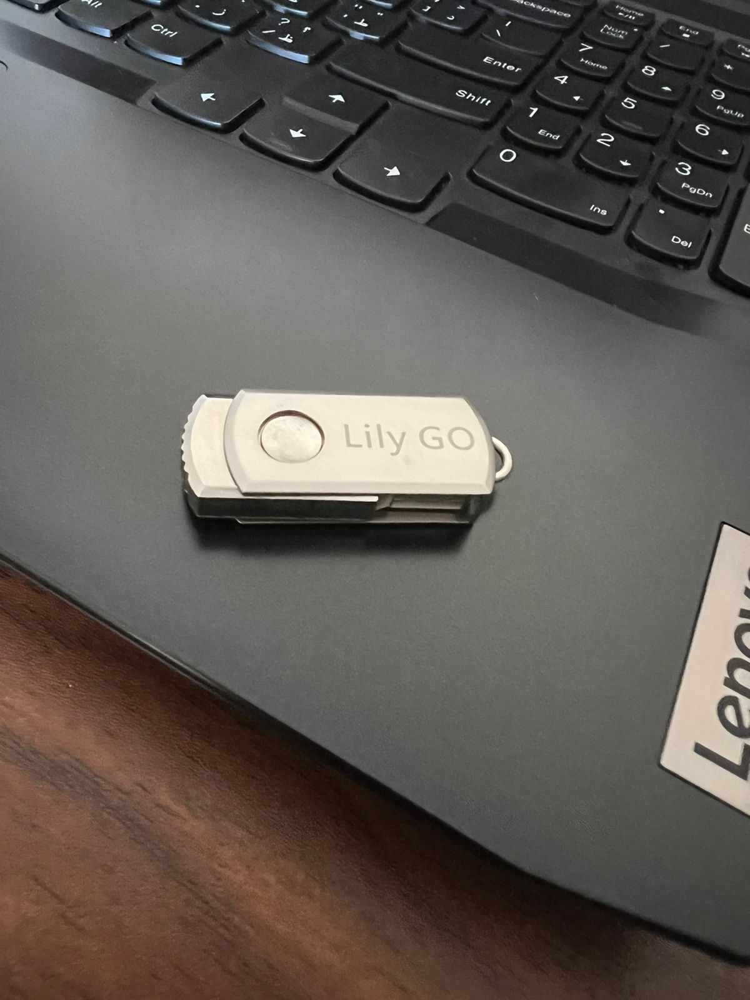

# lily-go-payloads
Lily go Badusb simple Payloads Examples
 
 

 
## [CMD](cmd)
simple  payload to run command as current user

## [Remote PS1](remote_ps1)
simple  payload to retrive powershell script and run in memory

## [UAC bypass](UAC_bypass)
simple UAC bypass payload to run command as admin

